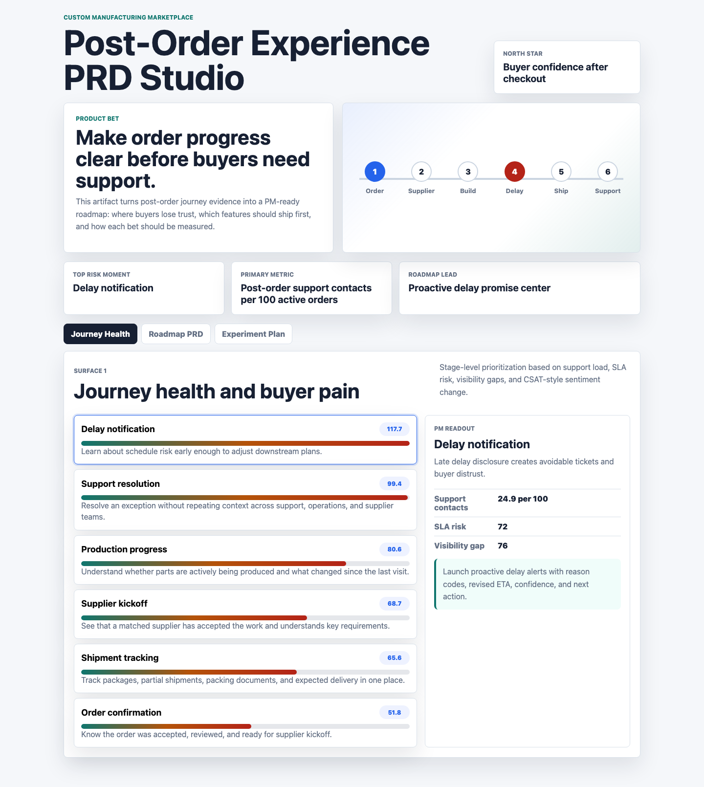
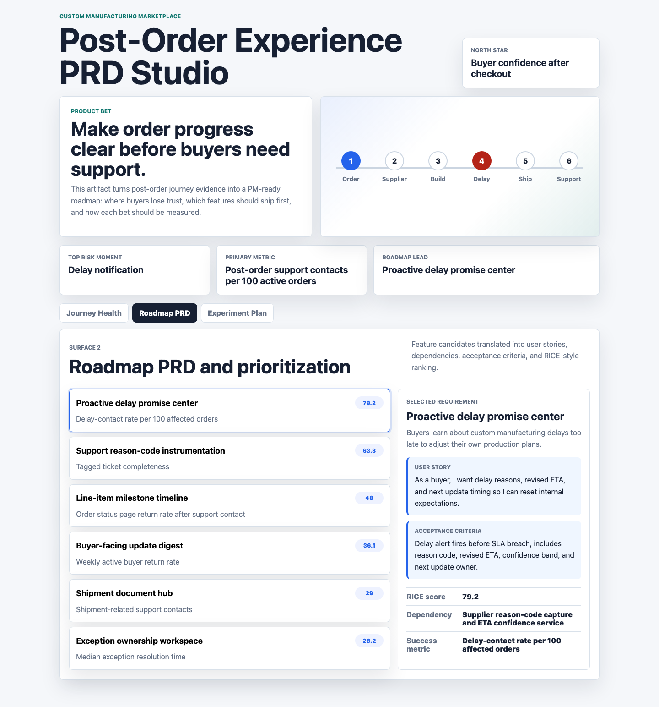
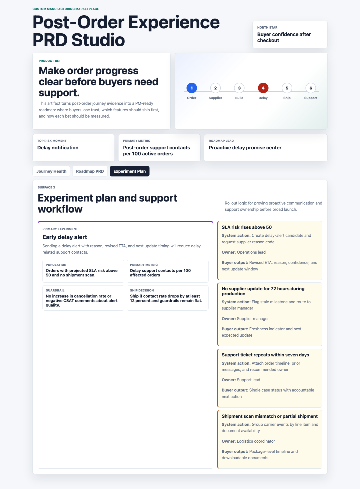

# Post-Order Experience PRD Studio

This is a product management portfolio artifact for a custom manufacturing marketplace. It focuses on the buyer journey after checkout: order confirmation, supplier handoff, production progress, delay communication, shipment tracking, and support resolution.

The artifact is intentionally not a generic dashboard. It is a PRD-style decision studio that uses synthesized operating signals to decide which post-order product bets should enter the roadmap, what requirements they need, and how each bet should be tested.

## Screenshots



Caption: The journey health surface ranks post-order moments by buyer pain, support load, SLA risk, visibility gap, and CSAT-style sentiment change. Delay notification emerges as the top trust gap.



Caption: The roadmap PRD surface translates the highest-risk journey moments into ranked feature candidates, user stories, dependencies, acceptance criteria, and success metrics.



Caption: The experiment surface defines how to test proactive delay alerts and support ownership workflows before broad rollout.

## What It Demonstrates

- Product thinking for a B2B transactional marketplace after the order is placed.
- User-centered prioritization across buyer transparency, fulfillment tracking, delays, communications, and support workflows.
- Data-informed roadmap judgment using a transparent prioritization heuristic rather than an opaque model.
- Cross-functional execution planning across product, operations, logistics, support, and supplier-facing teams.

## Data

All datasets are synthetic and generated by `scripts/score_operating_data.py`. They are not real company data and should not be interpreted as real marketplace performance.

The synthesized structure is modeled on common custom manufacturing marketplace workflows and public product-support patterns: buyer order status pages, line-item milestones, supplier updates, revised delivery dates, shipment tracking, packing documents, delay reason codes, support tickets, and escalation ownership.

Generated datasets:

- `data/journey_health.csv`: six post-order journey stages with buyer need, support contacts per 100 orders, SLA risk, visibility gap, CSAT-style sentiment change, and priority score.
- `data/feature_backlog.csv`: roadmap candidates with problem statements, user stories, reach, impact, confidence, effort, dependencies, acceptance criteria, and success metrics.
- `data/experiment_plan.csv`: experiments for delay alerts, milestone clarity, and exception ownership.
- `data/support_workflows.csv`: trigger-based support and operations workflows.
- `data/research_notes.csv`: synthesized research themes used to connect buyer pain to roadmap choices.
- `data/artifact_data.json`: browser-ready data consumed by the static app.

The prioritization score combines buyer pain, support contact rate, SLA risk, visibility gap, and CSAT-style sentiment movement. The feature score uses a RICE-style formula: reach times impact times confidence divided by effort.

## Role Connection

This artifact demonstrates the work expected from a Product Manager owning the post-order experience: identify moments where buyers lose trust, prioritize the roadmap, define product requirements, collaborate with operational teams, and measure whether new communication and support workflows improve the customer experience.

## Scope

This project does:

- Present a PM-ready product artifact with three distinct surfaces.
- Generate repeatable synthetic data and analysis outputs.
- Provide a clear roadmap recommendation and experiment plan.
- Run as a static browser app with no backend dependency.

This project does not:

- Claim to use real company data.
- Replace live buyer research, supplier interviews, or production telemetry.
- Implement production integrations with order management, support, carrier, or supplier systems.
- Forecast actual marketplace revenue, margin, or customer retention.

## Run Locally

```bash
python3 scripts/score_operating_data.py
python3 -m http.server 4173
```

Then open `http://127.0.0.1:4173`.
